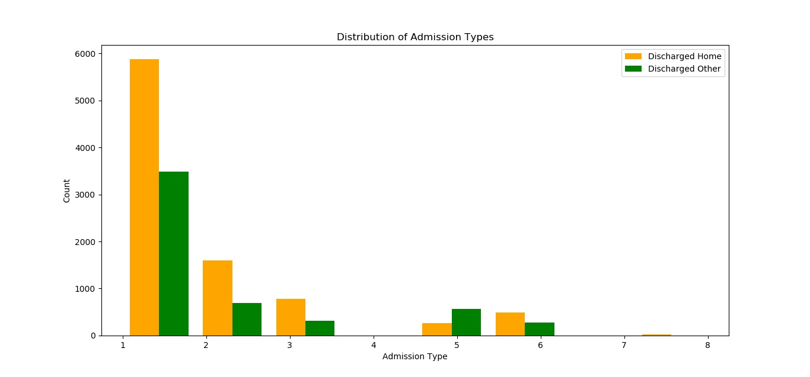
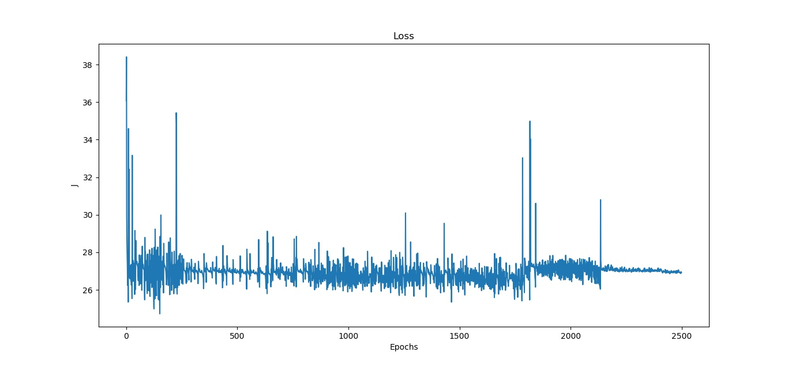

# RHadoopML-Project

This project is an introduction to using the Hadoop platform, R programming language, and the application of MapReduce. Once the data required is queried and processed, machine learning will be used to analyze the data. The data being analyzed is where the patients have a respiratory disease (as determined by their ICD9 scores) and whether they were discharged home or to other facilities based on the other features in the dataset. 

RHadoop Code: This was the code used to import, filter, and save the data using R and Hadoop. All the data regarding patients who would be classified as having respiratory diseases based on 'diag_1' tests were extracted. That data was split into two based on where they were discharged to go home or not. 

dataAnalysis.py and dataExtractionpy: These were codes used to primarily analyze the data straight from the CSV file prior to using MapReduce() with R & Hadoop. The purpose of this project was to learn R + Hadoop implementation to process data, however, in this script, the data is queiried and analyzed without the data being processed using RHadoop. This is not really a majoy factor since the query is simple and the resulting data would all the same. The other data analysis script is the one used to analyze the data after being processed using MapReduce with RHadoop. 

respiratoryAnalysis.py: This script contains the main code where the data is loaded from a CSV file which was generated by using RHadoop (data queried based on the description at the top of the README). This file contains data processing, data analysis, and the Neural Network algorithm used to classify the data. 

-------------
Few graphs which were used to help analyze the data to choose distinct features. More graphs can be found in the 'Graphs' folder of the repository. 

-- This histogram displays the distribution of the age in both classes (Discharged home and discharged other). Due to highly similarity in the dsitribution of the data, 'Admission Type' was not chosen as a feature .
Note: Home classes has about 4000 more samples of data. 

-- Graph displaying the loss function over 2500 epochs. 

